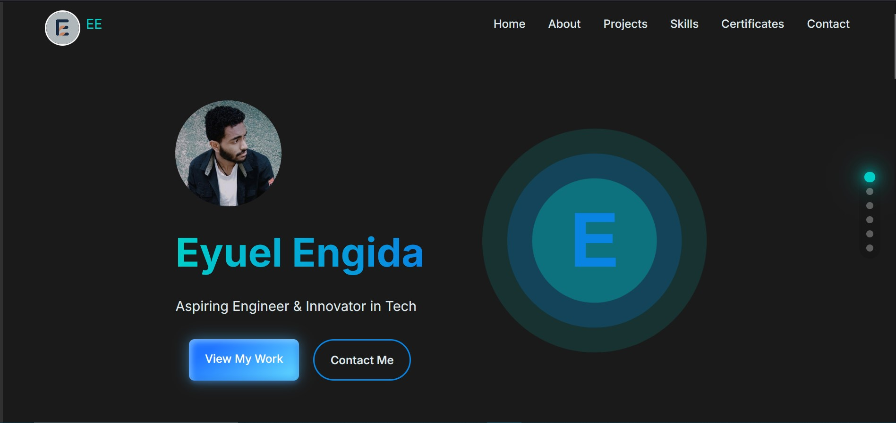

# Eyuel Engida's Personal Website

Welcome to my personal website repository! This site showcases my skills, projects, and passion for tech innovation. I’m Eyuel Engida, a developer and engineer, and this is where I share my work with the world.

## 🌐 Website
Visit my live website here: [eyuelengida.vercel.app](https://eyuelengida.vercel.app/).

## 📸 Website Preview


## 🎥 Message Submission Demo
Watch the demo of the message submission feature here:
https://github.com/user-attachments/assets/e0560b53-62c4-467c-9a29-f48f340c6b93

## 🚀 Project Overview
The website is designed to reflect my journey and professional growth. It includes sections about my experience, projects, and skills. Built with simplicity and responsiveness in mind, it works seamlessly on any device.

## 🛠️ Technologies Used
- HTML
- CSS
- JavaScript

## 📦 Installation Instructions
1. Clone the repository:
    ```bash
    git clone https://github.com/Eul45/eyuelengida.git
    ```
2. Install dependencies:
    ```bash
    npm install
    ```
3. Start the local server:
    ```bash
    npm start
    ```

This will run the project locally on your machine.

## 📫 Contact
Feel free to reach out:
- Email: [eyutechservices@gmail.com](mailto:eyutechservices@gmail.com)
- LinkedIn: [Eyuel Engida](https://www.linkedin.com/in/eyuel-engida-77155a317)

Thanks for checking out my repository!

---

> "Technology is best when it brings people together." – Matt Mullenweg
